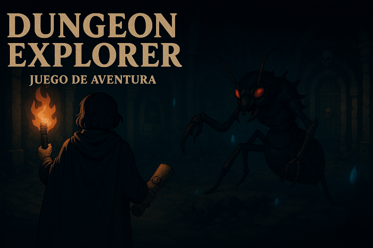

# 🧩 Dungeon Explorer - Juego de Aventura en Java


**Dungeon Explorer** es un juego de exploración narrativa con combate, objetos mágicos y decisiones que afectan el recorrido. El jugador despierta en una mazmorra misteriosa y debe avanzar por salas llenas de enemigos, tesoros y secretos. Cada partida es diferente gracias a la reconfiguración dinámica de las salas.

---

## 🎮 Dinámica del Juego

- **Exploración por salas**: El jugador avanza por pasillos y salas que pueden contener enemigos, armas, tesoros o eventos narrativos.
- **Sistema de combate**: Enfrenta enemigos con habilidades especiales. El daño recibido depende de tu salud, defensa y arma equipada.
- **Inventario y armas**: Puedes recoger armas y equiparlas en cualquier momento escribiendo `inventario`.
- **Narrativa interactiva**: Cada sala tiene ambientación única, con descripciones inspiradas en anime y fantasía oscura.
- **Eventos aleatorios**: Algunas salas secretas como `TreasureRoom2` pueden aparecer aleatoriamente, ofreciendo objetos mágicos o desafíos inesperados.
- **Decisiones del jugador**: Puedes elegir avanzar (`si`), detenerte (`no`), o gestionar tu equipo (`inventario`) en cada sala.

---

## 🗂️ Estructura del Proyecto
```
dungeon-explorer-jpizarroc99/
├── src/
│   ├── DungeonGame/
│   │   └── Main.java               # Punto de entrada del juego
│   ├── Interfaces/
│   │   ├── GameObject.java         # Interfaz base para objetos del juego
│   │   └── Room.java               # Interfaz para salas
│   ├── Intros_Bases/
│   │   └── IntroRoom.java          # Sala de introducción narrativa
│   ├── Jugador/
│   │   └── Player.java             # Clase que representa al jugador
│   ├── Objetos/
│   │   ├── Amuleto.java            # Objeto mágico especial
│   │   └── Arma.java               # Clase base para armas
│   └── Salas/
│       ├── ArsenalRoom.java        # Sala con armas
│       ├── ArsenalRoom2.java       # Sala con armas avanzadas
│       ├── EnemyRoomBase.java      # Clase base para enemigos
│       ├── EnemyRoomLevel1.java    # Enemigo nivel 1
│       ├── EnemyRoomLevel2.java    # Enemigo nivel 2
│       ├── EnemyRoomLevel3.java    # Enemigo nivel 3
│       ├── EnemyRoomLevel4.java    # Enemigo nivel 4
│       ├── EnemyRoomLevel5.java    # Jefe final
│       ├── TreasureRoom.java       # Sala de tesoro estándar
│       ├── TreasureRoom2.java      # Sala secreta con amuleto
│       └── VacuumRoom.java         # Sala narrativa sin enemigos
├── out/                            # Archivos compilados
│   └── production/
│       └── dungeon-explorer-jpizarroc99/
├── .idea/                          # Configuración del proyecto en IntelliJ
└── README.md                       # Documentación del juego
```
---

## 🛠️ Tecnologías Utilizadas

- **Lenguaje**: Java
- Programación orientada a objetos (POO)
- Código modular con clases por tipo de sala
- Uso de `Scanner` para interacción por consola

---

## 🎯 Objetivo del Proyecto

Este juego fue creado con fines educativos y creativos, buscando:

- Practicar buenas prácticas de programación en Java.
- Diseñar sistemas de juego modulares y escalables.
- Integrar narrativa interactiva con mecánicas de combate y exploración.
---

## 👩‍💻 Autora

**Javiera Pizarro** 